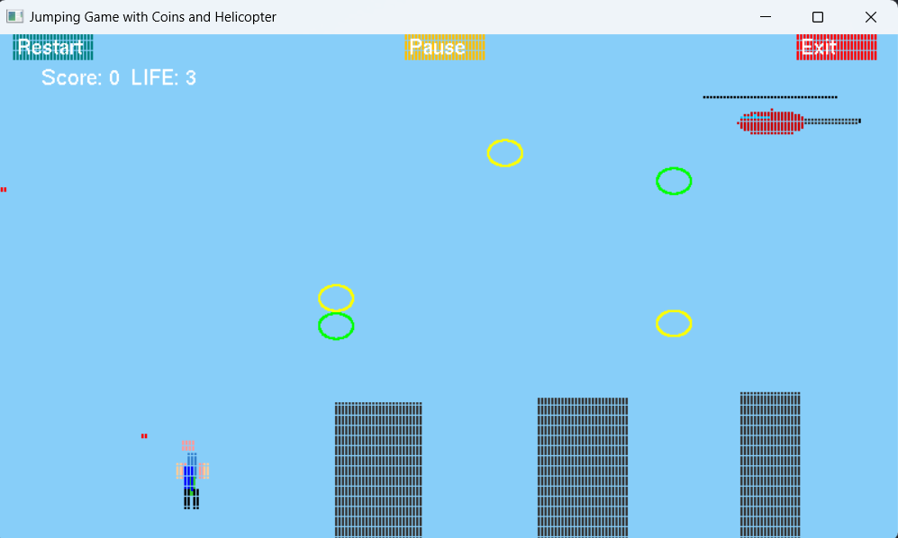

# BRACU Runner

 
 

**BRACU Runner** is a 2D arcade-style endless runner game built using Python and OpenGL. The player collects coins, avoids obstacles, and defeats enemies to achieve the highest score. The game features dynamic elements like rain, a shooting helicopter, and collectible coins, ensuring an engaging experience.

---

## Submitors
- [Mazbha Ul Haque](https://github.com/NoobCoderIsSed)
- [Farhan Haque Shakib]()
- [Hasnat Rafi Uddin](https://github.com/Maznu007)

## Key Features

### Player Mechanics
- **Jump** to avoid obstacles (press `Spacebar`).
- **Shoot bullets** to defeat enemies (press `F` key).
- Collect **black coins** for temporary invincibility.
- Lose lives upon collision with bullets, buildings, or the helicopter.

### Enemies
- **Helicopter**: Moves left, fires bullets, and has 4 lives. Destroy it for 50 points.
- **Bullets**: Fired by the helicopter in alternating patterns.

### Coins and Scoring
- **Regular Coins**: Add 1 point each.
- **Special Coins**: Add 5 points.
- **Black Coins**: Grant 5 seconds of invincibility.

### Obstacles
- Randomly spawning buildings and bullets challenge the player.

### User Interface
- Buttons to **restart**, **pause**, or **exit** the game.
- Displays **score**, **lives**, and **helicopter status**.

### Rain Effect
- Toggle rain visuals (press `R` key) for added atmosphere.

### Game Loop
- Smooth **60 FPS** gameplay with collision detection, spawning, and movement updates.

---

## Objective
Score as high as possible while surviving enemy attacks and collecting coins. The game blends smooth mechanics, engaging visuals, and interactive features, making it a fun and dynamic project.

---

